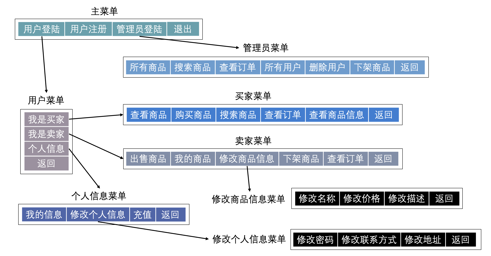
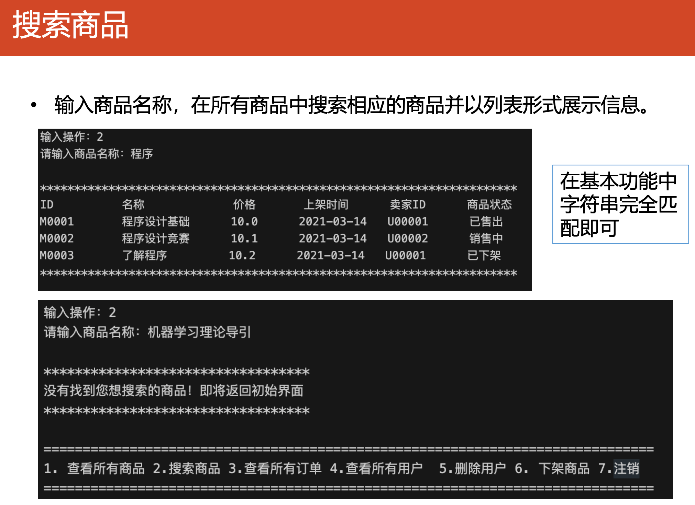

# 小蓝鲸交易系统

## 一、需求汇总

在这个项目中，我们需要实现如下的基本需求：

- 用户功能：
  - 登陆、注册、注销
- 买家功能
  - 查看、搜索商品
  - 购买商品
- 卖家功能
  - 商品的发布、下架
  - 查看已发布商品
  - 修改商品信息
- 查看历史订单
- 个人信息查看、修改
- 管理员功能
  - 登陆、注销
  - 查看、搜索、下架商品
  - 查看所有订单
  - 查看、删除用户
- 系统功能
  - 程序结束后再次打开程序，原本的数据不能丢失

_注意：不同的主体增删查改的权限是不一样的。_

## 二、交互结构

## 三、设计思路

针对涉及到的各种主体设计不同的数据类型，然后选择一种合适的数据结构在内存中存储数据，使用文件读写的方式来与外存交互，以保证程序结束后再次运行数据不丢失。

用户通过特定的接口或者界面与程序交互，接口/界面负责调用程序中已经设计好的算法来操作数据结构，同时获取结果，接口/界面再将算法的结果以某种形式反馈给用户。

具体可以用下图表示：

## 四、模块划分

主要分成如下模块：

| **名称** | **作用** |
| --- | --- |
| tools | 一些辅助工具（样式设计、日期、ID生成等内容） |
| menu | 菜单模块，接口模块的辅助模块 |
| good | 商品模块，包括涉及商品的算法和数据结构 |
| user | 用户模块，包括涉及用户的算法和数据结构 |
| order | 订单模块，包括涉及订单的算法和数据结构 |
| interface | 接口/界面模块，实现用户和数据结构的交互 |
| main | 程序入口 |

## 五、详细需求补充

_注：以下功能描述参考南京大学2021年春程序设计基础实验课程 project1 的需求描述。_

### 4.1 管理员功能简介

### 4.2 用户功能简介

### 4.3 数据储存示例

### 4.4 其他要求

## 六、参考测试样例

### 5.1 测试用例

**用例 1**

- 输入：打开程序
- 输出：程序正确运行，显示主菜单

### 5.2 用户功能

#### 5.2.1 登录/注册

**用例 2**

- 输入：选择用户注册选项，用户名“test_seller"，密码“654321”;
- 输出：注册成功并登录如果没有自动登录，则手动登录

**用例 3**

- 输入：选择注销登录选项
- 输出：注销并回到主菜单

**用例 4**

- 输入：选择用户登录选项，输入用户名和密码
- 输出：登录并显示主菜单

**边界用例**

- 登录时输入密码错误，应登录失败
- 注册时使用重复用户名，应提示用户已注册

### 5.3 卖家

**用例 5**

- 输入：选择发布商品选项，输入商品信息“test1”，“21.1”，“test_case_1”; 再次选择发布商品选项，输入信息“test2”，‘12.1’，“test_case_2”。
- 输出：发布成功

**用例 6**

- 输入：选择查看发布商品选项
- 输出：只能看到刚刚发布的两个商品，注意ID、商品状态、上架 时间的正确性

**用例 7**

- 输入：选择修改商品信息选项，将 test1 商品描述修改为“test case 1 modified”，并再次查看发布商品
- 输出：商品列表中，商品描述更改。

**用例 8**

- 输入：选择下架商品选项，输入 test1 的商品 ID，并再次查看发布 商品
- 输出：商品列表中该商品状态更改为“已下架”。

**边界样例**

- 输入商品价格时输入非数字
- 修改、下架商品时输入错误 ID，比如说 M1111111111，应返回“无权限修 改”或“商品不存在”之类的信息
- 验证此时依旧可以发布商品：
  - 输入：选择发布商品选项，输入商品信息“test_3”，“21.1”，“test_case_3”;
  - 输出：发布成功

### 5.4 买家、个人信息管理

**用例 9**

- 输入：注销当前用户，注册新用户“test_customer”，进入个人信 息管理界面，充值20
- 输出：充值成功

**用例 10**

- 输入：选择“修改个人信息”选项，将联系方式改为“111@nju”，查 看个人信息
- 输出：修改成功，个人信息界面显示新的信息

**用例 11**

- 输入：进入买家菜单，选择“查看商品列表”选项
- 输出：输出在售商品列表，包括 test2 商品。

**用例 12**

- 输入：选择“购买商品”选项，购买 test2 商品，再次查看商品列表
- 输出：购买成功(最好显示当前余额)，列表中 test2 不再可⻅

**用例 13**

- 输入：查看历史订单选项
- 输出：刚刚购买的订单

**边界用例**

- 再次购买某个商品，因余额不足购买失败
- 尝试输入错误 IDM00000000 购买商品
- 注销当前用户，注册新用户 test_customer，进入个人信息管理界面，充值 -100

### 5.5 管理员功能

**用例 14**

- 输入：选择“管理员登录”，输入姓名密码
- 输出：登录成功，显示管理员菜单

**用例 15**

- 输入：选择“查看所有商品”选项
- 输出：列出所有现有商品清单，包括三种状态：“已售出，销售中，已下架”，其中 test1 为已下架，test2 为已售出

**用例 16**

- 输入：选择“查看所有订单”选项
- 输出：列出所有现有订单清单，包括刚刚购买的订单

**用例 17**

- 输入：选择“搜索商品”选项，搜索“test1”
- 输出：以列表形式输出相应商品信息

**用例 18**

- 输入：选择“查看所有用户”选项
- 输出：列出用户，包括刚刚注册的两个新用户

**用例 19**

- 输入：选择“删除用户”，删除 test_seller 用户
- 输出：删除成功

**用例 20**

- 输入：注销，尝试登录 test_seller 用户
- 输出：登录失败